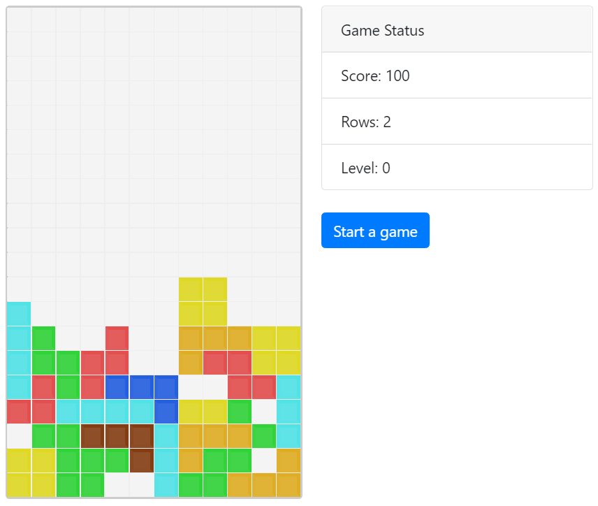

# Tetris game using React JS

A tetris game using React JS with Hooks, CSS3 and react-bootstrap.

<p align="center">
  
</p>

### Live demo
You can click [here](https://danielpaz6.github.io/React-Tetris-Game/) for live demo.

### Installing

Clone and install dependecies

```
git clone https://github.com/danielpaz6/React-Tetris-Game.git
cd react-tetris-game
npm install
npm start
```
